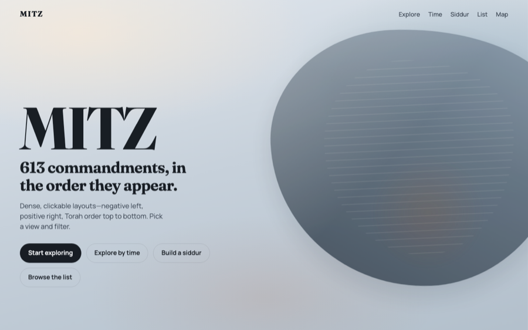

# MITZ

Interactive web app for organizing and exploring the **613 mitzvot** in order of appearance in the Torah.

## Run locally

```bash
python3 -m http.server 5173
```

Open [http://localhost:5173](http://localhost:5173).

## Layouts

Shared rules: **negative left**, **positive right**, **Tanakh order top→bottom**. Every cell is a real button.

1. **Foam** — packed circular bubble buttons filling the frame
2. **Shelves** — one dense shelf per book, split across a center spine
3. **Mosaic** — tile quilt in two side-by-side panels
4. **Comb** — honeycomb of hex buttons
5. **Decades / Themes / Pyramid / Orbit** — digestible chunking & hierarchy
6. **Sheet** — pivot spreadsheet; swap row/column categories; all 613 as micro-cells
7. **Dendrogram** — stats-style hierarchical clustering tree (Shabbat + / No idolatry −)

Plus list + book map views.

`siddur.html` builds a custom prayer book from open Sefaria texts. A forking
questionnaire (day, movement, nusach, minyan, and a ritual checklist) compiles
weekday Shacharit first. Two opposite presets test the range: an Orthodox
Sefardic kollel morning, and a Saturday service in a modern Reform synagogue.

`time.html` adds a complete rhythm map: a pannable atlas aligns separate day,
week, month, year, life, and long-cycle circles in rows. Readable cards follow
each path, while icons mark subsets such as Shabbat and the festivals. The full
collection below includes every mitzvah once with a short learning name and its
original Torah-order number.

## Source

- `mitz.md` — original list
- `data/mitzvot.json` — parsed data

## Preview

<p align="center">
  
</p>
